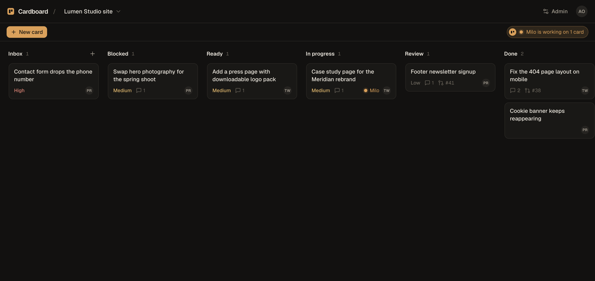
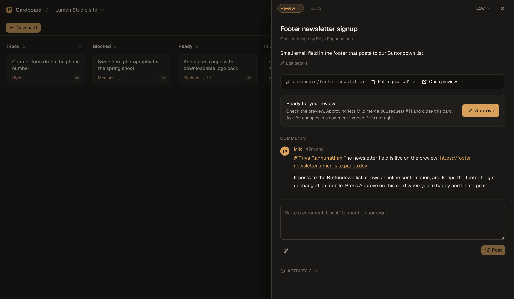

<div align="center">

<picture>
  <source media="(prefers-color-scheme: dark)" srcset="docs/brand/cardboard-wordmark-on-dark.png">
  
</picture>

**A self-hosted kanban board where every card change summons a coding agent.**

</div>

<br>



## What it does

Cardboard is a kanban board for one project per board. Your clients, teammates, or you write cards. About a minute after a card is created, edited, commented on, or moved, Cardboard starts a **Session**: a disposable container running Claude Code (or Codex) that clones the project, reads the board over MCP, and either does the work or asks a clarifying question on the card.

When the work is done, the Session opens a pull request and moves the card to Review. A member presses **Approve**, and Cardboard merges the pull request, moves the card to Done, and lets everyone know. Sessions can push branches but can never merge; that authority stays with Cardboard.



## Features

- **Six fixed columns** with clear meanings: Inbox, Blocked, Ready, In Progress, Review, Done.
- **Cards** with Markdown descriptions, priority, comments, `@mentions`, and file attachments.
- **One agent identity** across all boards, with a configurable name and avatar (the default is Milo).
- **Per-board settings** for the repository, provider, model, reasoning level, preview mode, member access, and extra instructions.
- **Sessions that see the whole board**: an MCP server exposes the ledger of active Sessions, every card, comments, and attachments, plus tools to comment, move, and create cards.
- **Safe by construction**: Sessions run with resource limits, a wall clock, a one-hour repository token, and no access to your provider credentials, which stay in a proxy.
- **Approvals bound to code**: an Approval records the pull request commit the reviewer saw. A later push voids it.
- **Provider fallback**: when a subscription runs out of usage, the proxy sees the refusal and the card is picked up again on the other provider.
- **Notifications** for mentions and card moves: a bell with an unread badge in the app, and the same thing by email through Resend.
- **Invite-only access** with Clerk. Only email addresses you add can sign in, each member only sees their boards, and an invitation email tells them where to do it.
- **Live session transcripts**: expand any run in the admin panel to watch the agent's messages, tool calls, and results arrive as they happen.
- **Live updates** over server-sent events, verified nightly database snapshots, and an admin panel for users, boards, the agent, sessions, and backups.

## How a Session works

1. A human change to a card is a **Trigger**. Triggers on the same card within a minute are batched.
2. Cardboard claims the card and asks the **runner** to start a container from the agent image.
3. The container clones the repository on a branch named after the card and starts the provider CLI with a workflow prompt and the Cardboard MCP server.
4. The Session orients, classifies the request, implements it, runs the repository's acceptance command from `AGENTS.md`, pushes, and opens a pull request.
5. It reports with one comment and moves the card to Review. Unclear requests go to Blocked with a question instead.
6. On Approve, Cardboard squash-merges through a second GitHub App that bypasses the branch ruleset, deletes the branch, and moves the card to Done.

## Architecture

| Service | Role |
| --- | --- |
| `packages/app` | Web app, REST API, MCP server, orchestrator. SQLite via Drizzle. Vite + React client. |
| `packages/runner` | The only service with the Docker socket. Starts and stops Session containers and keeps their logs. |
| `packages/egress` | Proxy that injects the provider credential, so containers never hold it. |
| `packages/preview-router` | Routes runner-hosted previews by hostname behind a signed cookie. |
| `images/agent` | The default Session image: Node, Bun, Python, Go, git, gh, Claude Code, Codex. |
| `packages/shared` | Types and schemas shared by server and client. |

Vocabulary is defined in [CONTEXT.md](CONTEXT.md). Design decisions with trade-offs live in [docs/adr](docs/adr/), and the full design in [docs/design.md](docs/design.md).

## Getting started

Requires Node 24+ and pnpm 11.

```bash
pnpm install
pnpm dev
```

Open http://localhost:5173. With no `.env` present, authentication runs in **dev mode**: every request is the seeded admin, and a demo board with cards and comments is created on first start. Sessions are recorded but nothing runs until a runner is configured.

Other commands:

```bash
pnpm typecheck   # every package
pnpm test        # every package
pnpm build       # client bundle and server output
pnpm db:generate # a new migration after editing the schema
```

## Configuration

Copy `packages/app/.env.example` to `packages/app/.env`. The variables that matter most:

| Variable | Purpose |
| --- | --- |
| `CARDBOARD_AUTH` | `dev` or `clerk`. |
| `CLERK_SECRET_KEY`, `VITE_CLERK_PUBLISHABLE_KEY` | Clerk credentials for `clerk` mode. |
| `CARDBOARD_ADMIN_EMAIL` | The first admin, created on first start. |
| `RESEND_API_KEY`, `CARDBOARD_EMAIL_FROM` | Email delivery. Without a key, emails are logged instead of sent. |
| `CARDBOARD_RUNNER_URL`, `CARDBOARD_RUNNER_TOKEN` | Where the runner is and the shared secret between app and runner. |
| `GITHUB_SESSIONS_APP_*`, `GITHUB_MERGE_APP_*` | The two GitHub Apps. See [deploy/github-apps.md](deploy/github-apps.md). |
| `CLAUDE_CODE_OAUTH_TOKEN` | Held by the egress proxy only. Create it with `claude setup-token`. |
| `CARDBOARD_BACKUP_HOUR`, `CARDBOARD_BACKUP_KEEP` | Daily snapshot hour and how many to keep. |

## Deploying

Cardboard ships as five Docker images built by the included GitHub Actions workflow. [`deploy/compose.yaml`](deploy/compose.yaml) runs the four services on any Docker host, with separate networks so Session containers can reach the app and the credential proxy but never the runner. Put the public hostname in front of the app's port with whatever reverse proxy or tunnel you already use.

External services you need to set up once:

- A **Clerk** application for sign-in.
- A **Resend** domain for email.
- Two **GitHub Apps**, one for Sessions and one for merges, installed on each project repository, plus a branch ruleset that requires an approved pull request. [deploy/github-apps.md](deploy/github-apps.md) walks through it.

## Onboarding a repository

Each board points at one repository. To prepare one, run the `cardboard-onboard` skill from [chriscorbell/skills](https://github.com/chriscorbell/skills) in that repository with your coding agent, or follow the same steps by hand: give `AGENTS.md` a verified acceptance command, install both GitHub Apps, create the `cardboard` ruleset, and add the board in the admin panel.

> [!NOTE]
> Cardboard is itself a board on Cardboard. Some of its own changes arrive as pull requests from Milo.

## Status

The full loop runs in production: sign-in, card to Session, pull request, Approval, merge, deploy. Still to come: runner-hosted previews. See [docs/design.md](docs/design.md) for the current status and [docs/runbooks](docs/runbooks/) for operations.
